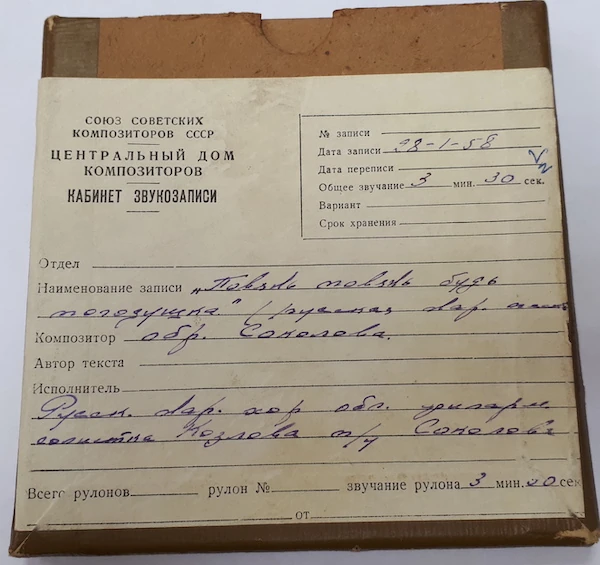
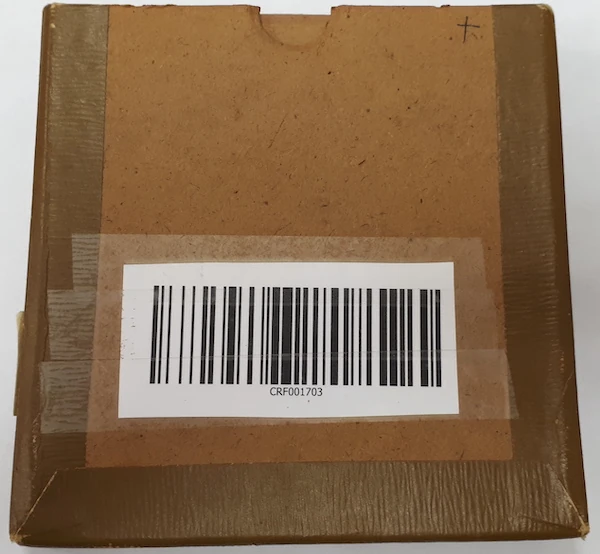
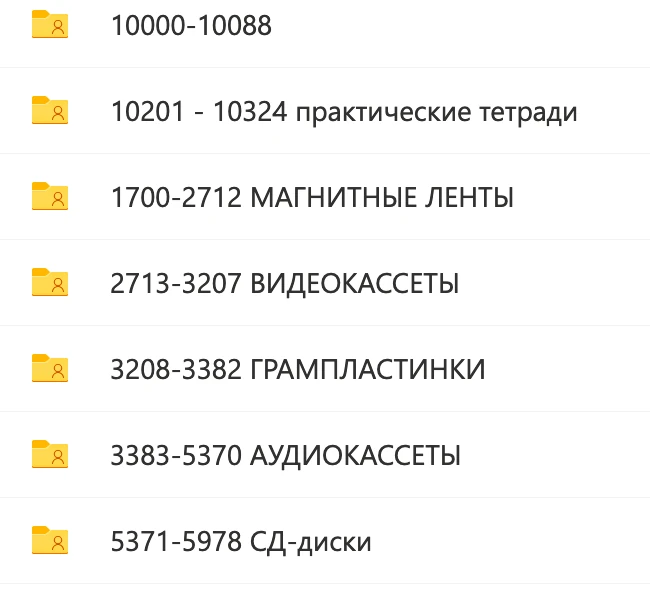

---
title: "Архивотерапия"
date: 2026-01-10T18:03:35+03:00
draft: false

author: "Кирилл В. Чеботарёв"
tags: ["волонтёры", "добровольцы", "открыть архивы"]

description: "Этот текст написан для того, что бы его отправлять в случае необходимости в качестве ответа на очередной призыв спасать фольклор.  
Вдохновил меня на это Сергей Николаевич Старостин, а идея была позаимствована у хорошего аналогичного текста НЕПРИВЕТ. Ознакомьтесь на досуге и с ним тоже. Не помешает."
canonicalURL: "https://arch.folkcentr.ru/all/arhivoterapiya/"

showToc: true
TocOpen: false
hidemeta: false
comments: false

disableHLJS: false
disableShare: false
hideSummary: false
searchHidden: false

ShowReadingTime: true
ShowBreadCrumbs: true
ShowPostNavLinks: true
ShowWordCount: true
ShowRssButtonInSectionTermList: true
UseHugoToc: true

cover:
  image: "cover.webp"
  alt: ""
  caption: ""
  relative: true
  hidden: false
---

<!-- Текст статьи начинается здесь.
Картинки можно просто перетаскивать в эту папку. -->
[Ссылка на НЕПРИВЕТ](https://neprivet.com)

Итак, периодически в интернете всплывает очередной призыв к спасению фольклора. Как правило содержание призыва сводится к тому, что нужно спасать архивы, нужно их оцифровывать, выкладывать в интернет и вообще что-то делать. Гибнет культура русского народа и всё в таком духе. Последний прочитанный мной призыв был подкреплен тремя фотографиями автора в разных позах. Для чего это было сделано мне неясно, но к спасению фольклора отношение имело явно весьма посредственное.

Делать что-то надо. Есть проблема, точнее две проблемы.  
1) Пропадает культурное наследие  
2) Сильное беспокойство по этому поводу (фрустрация)

Вывод напрашивается сам собой, надо идти и спасать и тем самым избавляться от неприятного чувства.  
И с этим я как раз могу помочь. У Центра русского фольклора есть что спасать.  
Перечень требующихся работ примерно таков:  
Есть несколько тысяч единиц разных носителей Фольклорной комиссии, которые не были вывезены в Пушкинский дом и достались на хранение Центру русского фольклора. На сегодняшний день все носители получили свой регистрационный номер.

Так выглядит коробка с  бобиной и на ней новый регистрационный номер (см. фото)
Все эти носители и их реестры отсняты на фотоаппарат и выложены в облако. 

**Задача первая** — прочесть надписи на фотографиях и занести эти данные в _exel_ файл вместе с присвоенным номером.

{}

{}

**Задача вторая** — оцифровать эти носители. Часть из них не имеет опознавательных знаков вообще, поэтому в процессе оцифровки нужно прослушать запись и в случае если собиратель продиктовал, что и где он записывает так же внести эти данные в _exel_ файл.

Записи ФК не единственные нуждающиеся в оцифровке. Я привел их лишь для примера.  
И на этом работа с материалом не закончится, так как его нужно будет далее заносить в [банк данных](https://github.com/kirdik/folklore_base) и описывать уже досконально.  
Итак, теперь вы знаете что делать.  
К сожалению, мой опыт работы в архиве показывает, что благородного порыва хватает на один — два дня работы. Но, как результат, человек наконец-то избавляется от гложущего его беспокойства по поводу гибнущего наследия. 

**Архивотерапия работает безотказно.**  

Если вас не устраивает такой оффлайн способ, то у меня есть и удаленный способ.  
Спасибо _covid-19_, он научил нас работать в онлайне!  
Для этого я могу вам рассказать о краудфандинге у фольклористов. _Бусти_, _Патреон_ и прочее в наличии. Пара сотен рублей отправленных на благое дело резко снимают острые приступы беспокойства.  
Терапия абсолютно безвредна. Привыкания нет, синдрома отмены тоже.